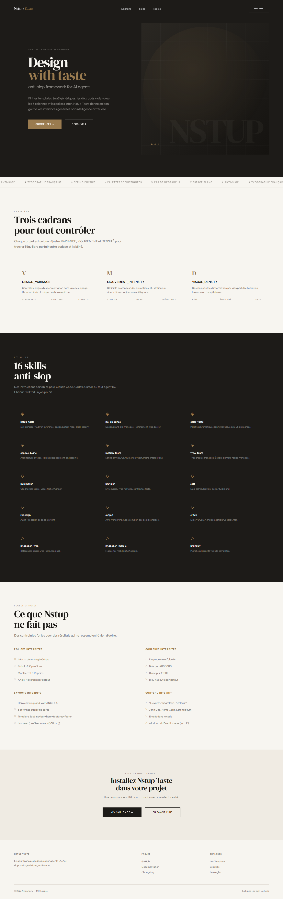
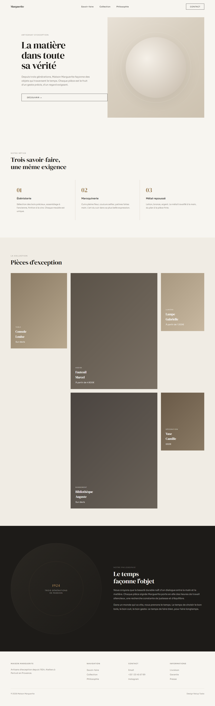
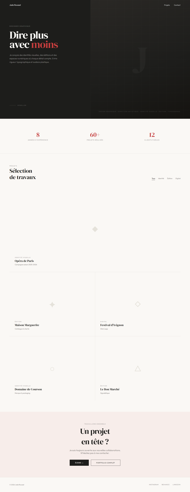
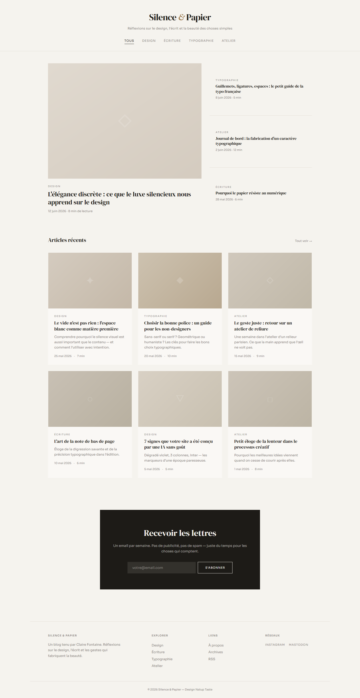

# Nstup Taste

**Anti-Slop Design Framework for AI Agents**

Nstup Taste gives your AI-generated interfaces actual taste. No more generic SaaS templates, purple-blue gradients, 3-column card layouts, or Inter font.

Inspired by [taste-skill](https://github.com/leonxlnx/taste-skill) — reimagined with French elegance and precision.

<p align="center">
  
</p>

## Installation

```bash
npx skills add https://github.com/mud-mos23/nstup-taste
```

Install a specific skill:

```bash
npx skills add https://github.com/mud-mos23/nstup-taste --skill "nstup-taste"
```

## Skills

### Implementation Skills (code)

| Skill | Install Name | Description |
|-------|-------------|-------------|
| **nstup-taste** | `nstup-taste` | v2 main skill. Brief inference, 3 dials (VARIANCE / MOTION / DENSITY), Design System Map, Dark Mode Protocol, Block Library, Pre-Flight Check. |
| **nstup-taste-v1** | `nstup-taste-v1` | v1 preserved for backward compatibility. |
| **iso-elegance** | `iso-elegance` | Refined French design. Balance, quiet luxury, minimalist architecture. |
| **color-taste** | `color-taste` | Sophisticated color palettes. oklch() system, 5 preset ambiances, auto dark mode. |
| **espace-blanc** | `espace-blanc` | White space architecture. Spacing tokens, void philosophy, layout rhythm. |
| **motion-taste** | `motion-taste` | Premium animation. Spring physics only, GSAP ScrollTrigger, motion/react. |
| **typo-taste** | `typo-taste` | French typography. clamp() scale, recommended fonts, French typesetting rules. |
| **minimalist** | `minimalist-ui` | Editorial UI (Notion/Linear vibes). Clean, functional, no decoration. |
| **brutalist** | `industrial-brutalist-ui` | Swiss brutalist style. Military typography, strong contrast, rigid grids. |
| **soft** | `high-end-visual-design` | Quiet luxury UI. Double-Bezel, Fluid Island, Magnetic Buttons. |
| **redesign** | `redesign-existing-projects` | 4-phase audit + redesign of existing code. |
| **output** | `full-output-enforcement` | Anti-truncation. Full code, no placeholders, no TODO. |
| **stitch** | `stitch-design-taste` | Google Stitch-compatible DESIGN.md export. |

### Image Generation Skills

| Skill | Install Name | Description |
|-------|-------------|-------------|
| **imagegen-web** | `imagegen-frontend-web` | Web design references (hero, landing, sections). 16:9 format. |
| **imagegen-mobile** | `imagegen-frontend-mobile` | Mobile mockups (iOS/Android). 9:16 portrait format. |
| **brandkit** | `brandkit` | Visual identity boards (logo, palette, typography, applications). |

## Example Sites

Complete example sites built with Nstup Taste are available in the [`examples/`](examples/) directory. Each is a standalone HTML/CSS project.

### Maison Marguerite — Luxury Craftsmanship Landing Page

A refined landing page for a Parisian artisan house. Features iso-elegance design: generous whitespace, warm beige/brown palette, asymmetric layout, subtle animations.

<p align="center">
  
</p>

### Jade Roussel — Creative Portfolio

A graphic designer portfolio with dark/red palette, full-bleed hero, marquee animations, project grid with hover overlays, and smooth scroll experience.

<p align="center">
  
</p>

### Silence & Papier — Editorial Blog

A warm editorial blog with mixed serif/sans typography, featured hero article, 3-column card grid, dark newsletter form, and sophisticated beige palette.

<p align="center">
  
</p>

## The 3 Dials

| Dial | Role | 1-3 | 4-7 | 8-10 |
|------|------|-----|-----|------|
| **DESIGN_VARIANCE** | Layout experimentation | Symmetric | Measured asymmetry | Bold / experimental |
| **MOTION_INTENSITY** | Animation depth | Static | Scroll animations | Cinematic |
| **VISUAL_DENSITY** | Information per viewport | Airy | Balanced | Dense |

## Anti-Slop Rules

- ❌ Inter, Arial, Helvetica
- ❌ Purple/blue AI gradients
- ❌ Pure black `#000000`
- ❌ 3-column equal card layouts
- ❌ "Elevate", "Seamless", "Unleash"
- ❌ Emojis in code
- ❌ `h-screen` → use `min-h-[100dvh]`

- « French guillemets » required
- `clamp()` based spacing
- Spring physics for motion
- `max-width: 65ch` for text

## opencode Configuration

The project includes ready-to-use opencode agents:

```bash
cp -r .opencode/ ~/your-project/.opencode/
```

- **nstup-designer** — Applies French design rules
- **nstup-redesigner** — Audits and redesigns existing code
- **nstup-strict** — Anti-placeholder, anti-truncation

## Validation

```bash
bash scripts/validate-skills.sh
```

A GitHub Actions workflow validates all skills on every push (frontmatter, registry, README consistency).

## Feedback & Contributions

- Issues / PRs on GitHub
- [@mud_mos23](https://github.com/mud-mos23)

## License

MIT License — Copyright (c) 2026 mud-mos23
